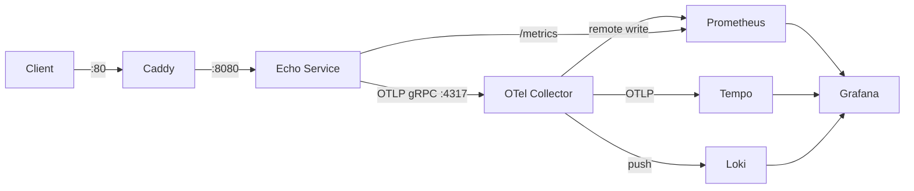

# binoc

Observability playground — a minimal Go service paired with different monitoring stacks.

## Architecture



## Quickstart

```bash
make up        # builds echo service, starts Grafana LGTM stack
```

Open:

| Service    | URL                    |
|------------|------------------------|
| Echo (via Caddy) | http://localhost       |
| Grafana    | http://localhost:3000  |
| Prometheus | http://localhost:9090  |

Try it:

```bash
curl localhost/echo?msg=hello
curl -X POST -d 'ping' localhost/echo
```

Default Grafana credentials: `admin` / `admin`.

## Stacks

| Stack          | Directory                  | Description                            |
|----------------|----------------------------|----------------------------------------|
| `grafana-lgtm` | `stacks/grafana-lgtm/`     | Loki + Grafana + Tempo + Prometheus    |

Select a stack: `make up STACK=grafana-lgtm`

## Make Targets

| Target   | Description                          |
|----------|--------------------------------------|
| `up`     | Build and start the stack            |
| `down`   | Stop the stack and remove volumes    |
| `logs`   | Tail logs from all services          |
| `build`  | Build the echo service image only    |
| `list`   | List available stacks                |

## Project Structure

```
docker-compose.base.yml      # shared services (echo + caddy)
service/
  cmd/echo/main.go           # entrypoint
  internal/
    config/                   # env-based configuration
    server/                   # HTTP server, routes, middleware
    instrument/               # logging, metrics, tracing setup
  Dockerfile                  # multi-stage distroless build
  Caddyfile                   # reverse proxy config

stacks/
  grafana-lgtm/
    docker-compose.yml        # stack definition (includes base)
    otel-collector.yml        # OTel Collector pipelines
    prometheus.yml            # scrape config
    loki.yml                  # log storage config
    tempo.yml                 # trace storage config
    provisioning/             # Grafana auto-provisioning
```

Each stack's `docker-compose.yml` includes `docker-compose.base.yml` so the echo service and Caddy proxy are defined once and shared across stacks.
